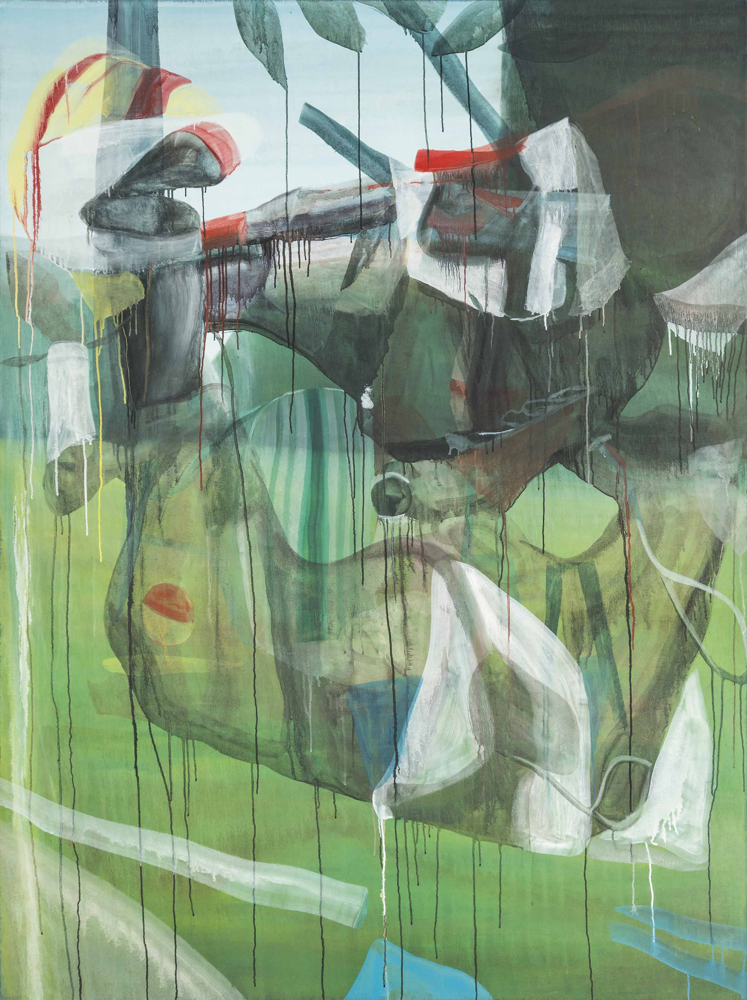

# A la manière de Marc Desgrandchamps

J'aimerais vous présenter le travail de Marc Desgrandchamps et vous proposer une activité à partir de sa manière de travailler. 
Marc Desgrandchamps est né en 1960 à Sallanches. Il étudie à l’école des Beaux-Arts de Paris (1978-1981), il vit et travaille aujourd’hui à Lyon. Peintre majeur de la scène artistique française, il joue sur les notions d’opacité, de transparence et de surimpression. Si sa peinture est figurative, la perspective est souvent tordue, l’espace indéfini et des anomalies surgissent : corps morcelés, objets fantomatiques. Ses œuvres, puisant leurs références dans de nombreux univers (histoire de l’art, photographie, cinéma, littérature, musique, mais aussi des photos personnelles), éprouvent les limites de la figuration. Il cultive, selon ses propres mots « une peinture du doute, doute de la figure, doute de la présence, doute même de la peinture ». Ce doute passe par la transparence, qui est aussi une manière de parler du temps et du passage. Autre motif récurrent chez lui, la figure féminine, notamment celle des baigneuses, qui occupe une place centrale. Il existe en effet des constantes fortes dans ses tableaux, comme certains sites ou l’omniprésence du ciel bleu. Dans un entretien avec Michael Peppiatt (Marc Desgrandchamps, Soudain hier, Repères n°166, 2016) il dit : « Ce qui suscite chez moi l’envie de peindre, c’est souvent un stimulus visuel, qui peut être quelque chose que j’ai vu réellement, par exemple un paysage traversé, un bâtiment qui m’intrigue ». Marc Desgranchamps a bénéficié de plusieurs grandes expositions notamment au Musée d'art contemporain de Strasbourg (2004), au Musée d'art contemporain de Lyon (2004), au Kunstmuseum de Bonn (2005), au Musée national d'Art moderne - Centre Georges Pompidou (2006), ainsi que d’une rétrospective importante au Musée d’Art moderne de la Ville de Paris (2011). Il est présent au sein de collections institutionnelles françaises : FRAC Ile-de-France - Le Plateau, Musée d'art moderne et contemporain de Saint-Étienne, Musée Régional d'Art Contemporain Languedoc-Roussillon à Sérignan, Musée d'Art Contemporain de Lyon, Musée des Beaux-Arts de Caen, Musée d'Art Moderne et Contemporain de Strasbourg. Il est représenté par la galerie Lelong à Paris. 

Dans son travail, on voit souvent la présence du corps et du paysage, qui parfois s'entremellent dans le champs visuel.

Ces paysages sont traités avec une peinture très liquide, avec des coulures participant à la composition du tableau. 

Les corps sont transparents, et ajoutés par dessus le paysage, créant ainsi une atmosphère de proche d'un rêve. 

Ces corps sont immenses et prennent parfois tout l'espace de la composition, comme des représentations de divinités.

Desfois aussi, les fragments de corps et paysage sont entremellés dans le même plan, créant ainsi des sortes d'abstractions. 

Certains tableaux sont d'une grande efficacité dans l'économie de moyens.

D'autres résonnent aussi avec des images plus actuelles, comme les corps tronqués que l'on peut voir en se balladant sur Google StreetView. 

.png)
.png)

A partir de la démarche exposée de Marc Desgranchamps, je vous propose de créer des images mélant paysages et figures. Utilisez les reférences visuelles que vous voulez, ainsi que les matériaux de votre choix (peintures à base d'eau, encres, peinture à l'huile diluée à l'essence, etc.)