# Le corps fragmenté

Dans l'histoire de l'art, la présence du corps est une constante. Son idéalisation a été souvent revue selon les paradigmes d'une époque ou d'une culture : paradigmes moraux, étiques, esthétiques, philosophiques, religieux... L'intégrité du corps représenté a ainsi été variable dans l'histoire de l'art. Cette intégrité physique reflète l'intégrité des valeurs d'une époque assujettie aux faits de l’histoire et aux pouvoirs (et contre-pouvoirs) mis en place dans une société. 
Nous pouvons voir ainsi des corps désincarnés et archétypaux dans l’art égyptien, des corps flottants et profanes des Ukiyo-e japonais, des corps occupant un espace organisé géométriquement par la perspective de la Renaissance italienne, des corps idéalisés du Néoclassicisme Napoléonien, normés par les affiches du IIIe Reich ou déconstruits voire mutilés par les modernismes du 20e siècle en Occident. 
La représentation du corps fragmenté est aussi présente dans les arts (peinture, littérature), non seulement dans notre époque, mais à chaque moment charnière de l’histoire où nous constatons un changement de paradigme. 

Avec la transformation, par exemple, du style italo-byzantin au style gothico-siennois, nous voyons l’apparition, dans la peinture de Giotto, d’angelots à moitié corps traversant le ciel. 
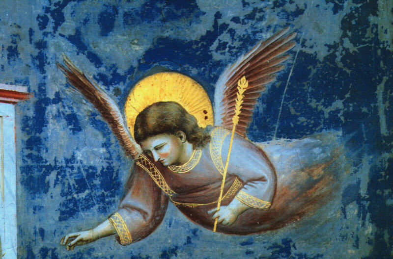 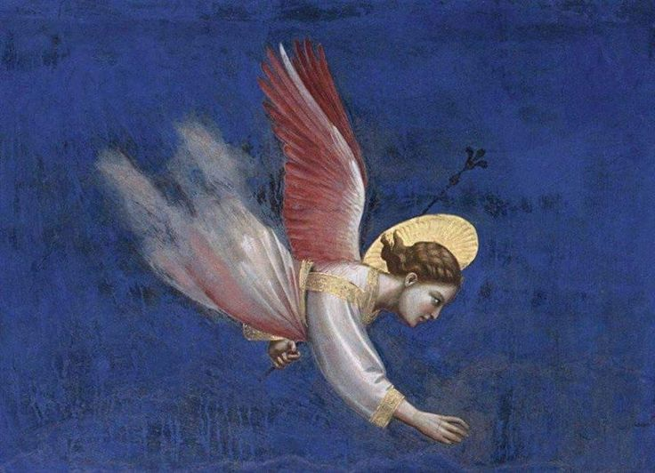

Dans l’oeuvre de Caravaggio, qui annonce une révolution visuelle dans la peinture, on peut trouver diverses têtes coupées.
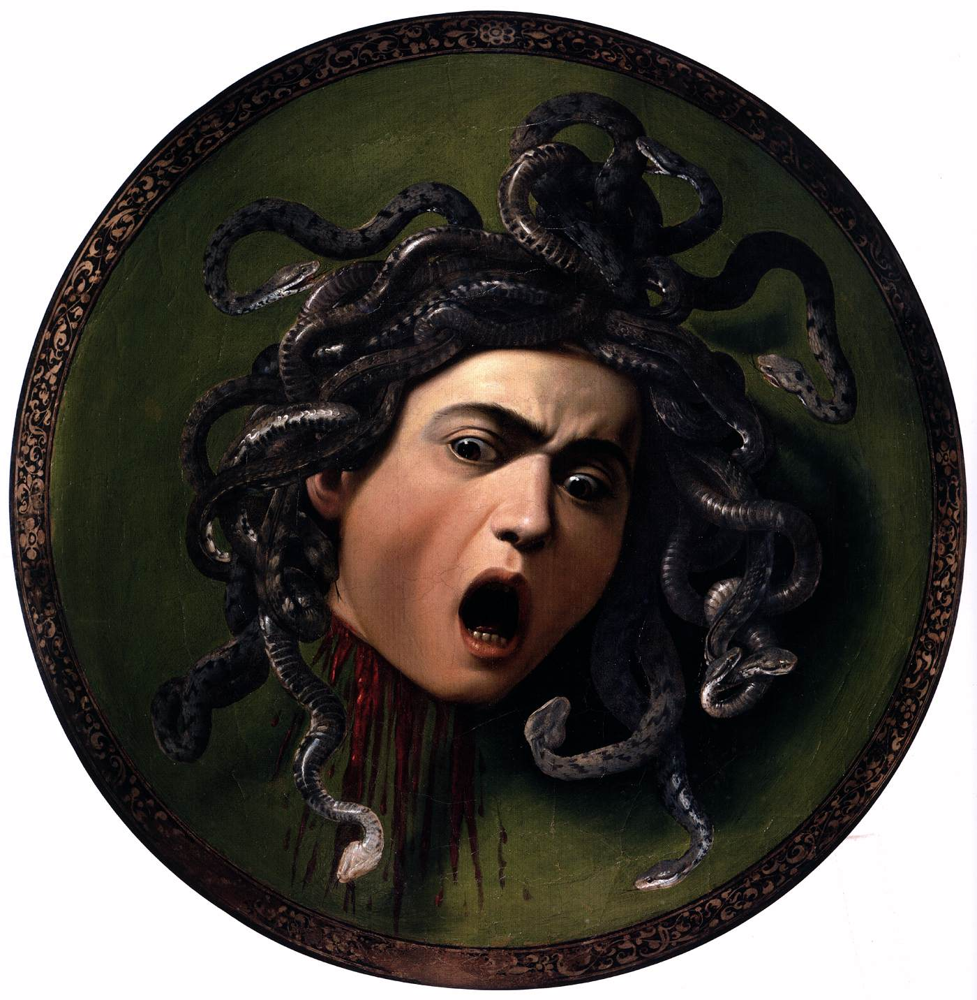.jpg)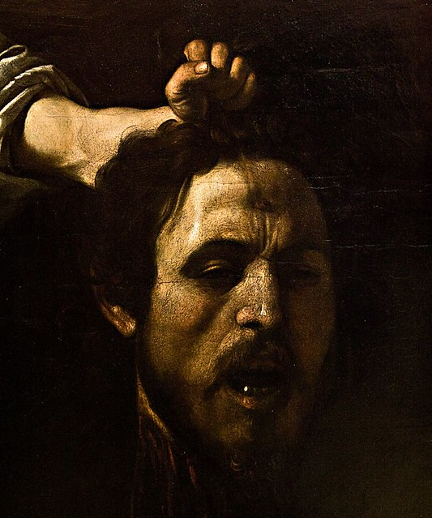

Le détachement de la tête est l’affirmation de la chair, d’un individu qui ne peut exister que dans l’unité du corps avec l’esprit. Voici une oeuvre d’Artemisia Gentileschi, Salomé avec la tête de Saint Jean-Baptiste.
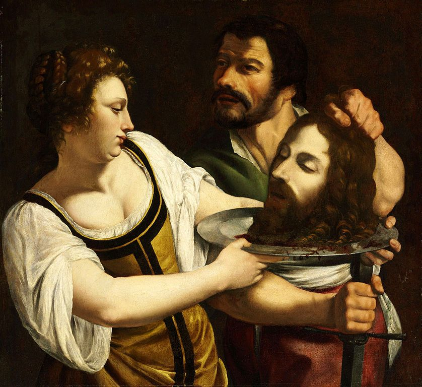

Goya, en pleine Inquisition Espagnole, évoque des mythes païens comme Saturne dévorant un de ses fils, ainsi que la cruauté de la guerre Napoléonienne sur le territoire espagnol à travers la série de gravures Les désastres de la guerre.
 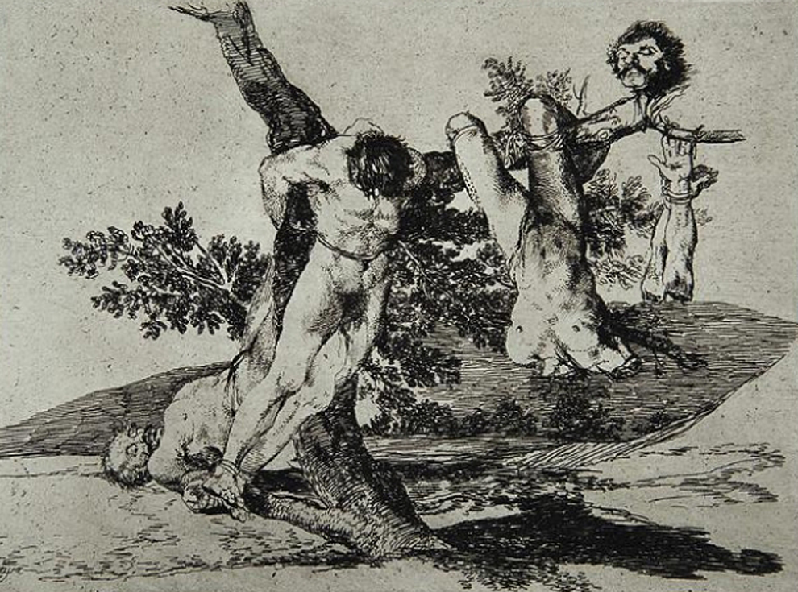

On retrouve un commentaire semblable chez Pedro Américo, peintre brésilien qui relate l’démembrement publique du martyr insurrectionniste Tiradentes pendant  la colonisation portugaise. 
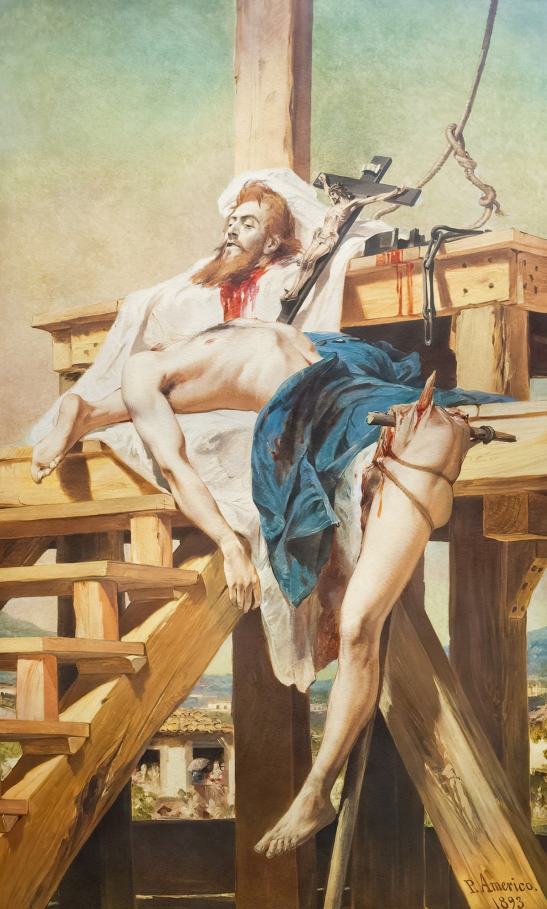

En France, Théodore Géricault, aborde la réalité du monde de façon crue. Il s’intéresse notamment à la littérature Romantique et aux faits divers pour composer son œuvre. Il réalise nombreuses études d’après des membres de cadavres comme celui-ci.
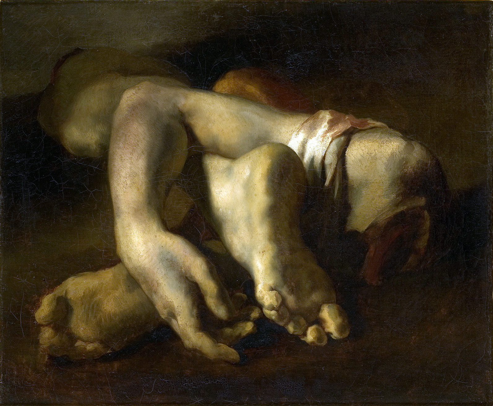

Otto Dix relate des corps mutilés par la Première Guerre dans son œuvre. 
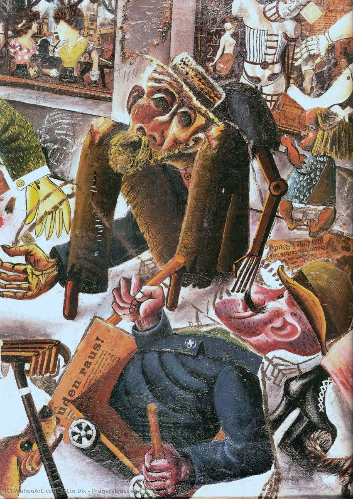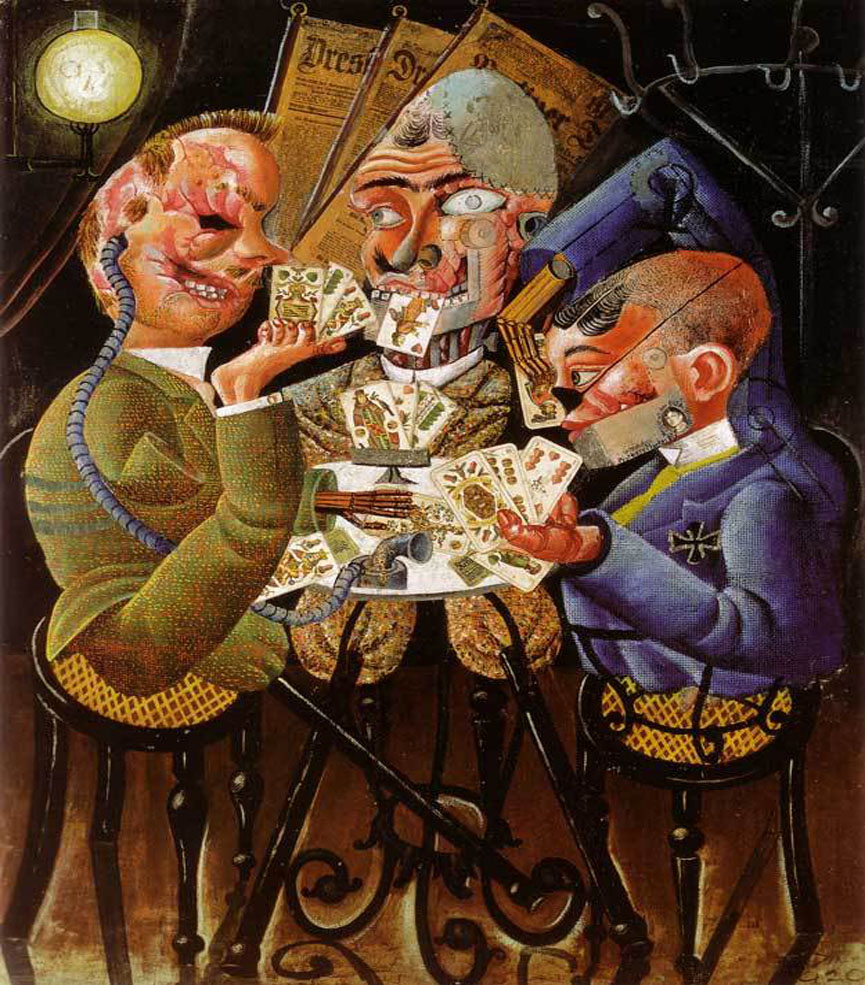

Avec Guernica, Pablo Picasso opère une nouvelle révolution visuelle dans l’art occidental au même temps qu’il dénonce les atrocités de la guerre en Espagne.
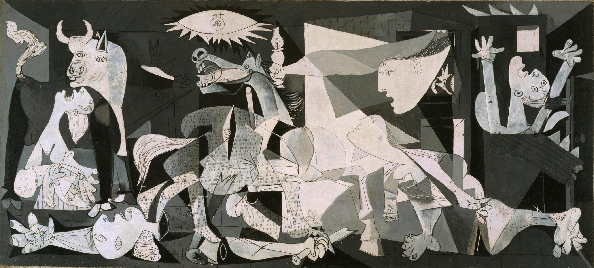

Francis Bacon fragmentera les corps dans sa peinture pour essayer de «toucher le directement le système nerveux» du spectateur. 

Adrien Ghenie, jeune peintre roumain, continuera dans la voie ouverte par Bacon en travaillant les limites de la figuration et abstraction.
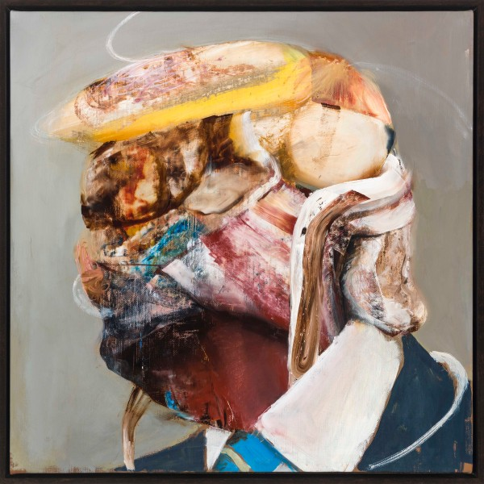 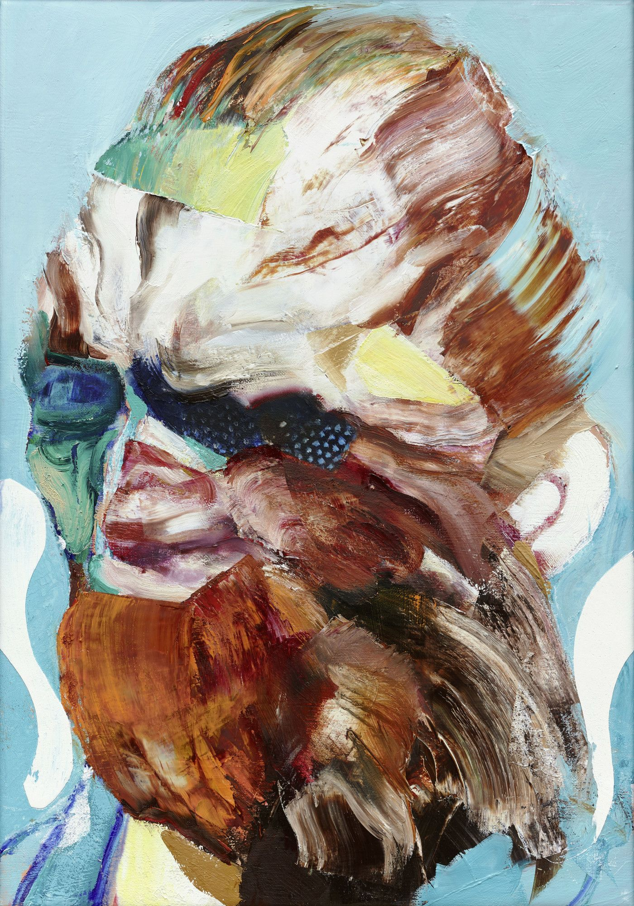

Justin Mortimer, peintre anglais, utilise des montages numériques sur photoshop d’après modèles vivants pour créer ses compositions picturales. 
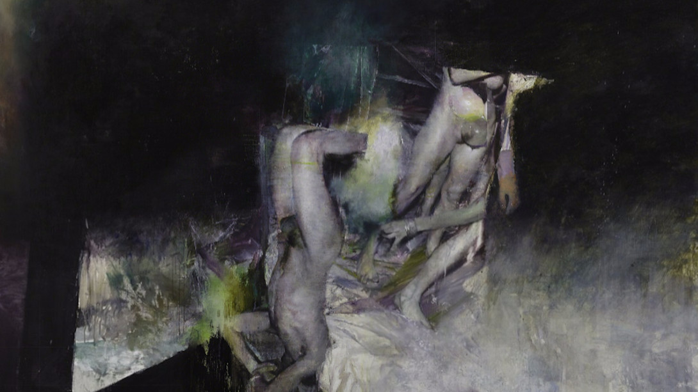 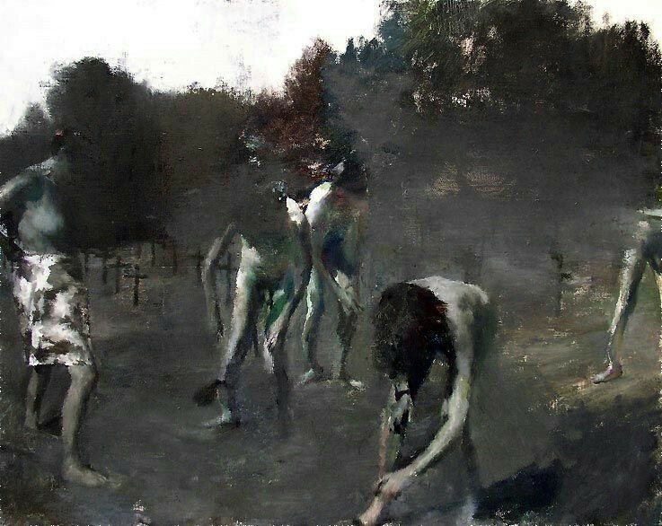

L’artiste brésilien Eduardo Berliner crée un patchwork de formes et corps à partir de fragments de la réalité capturés avec son appareil photo.
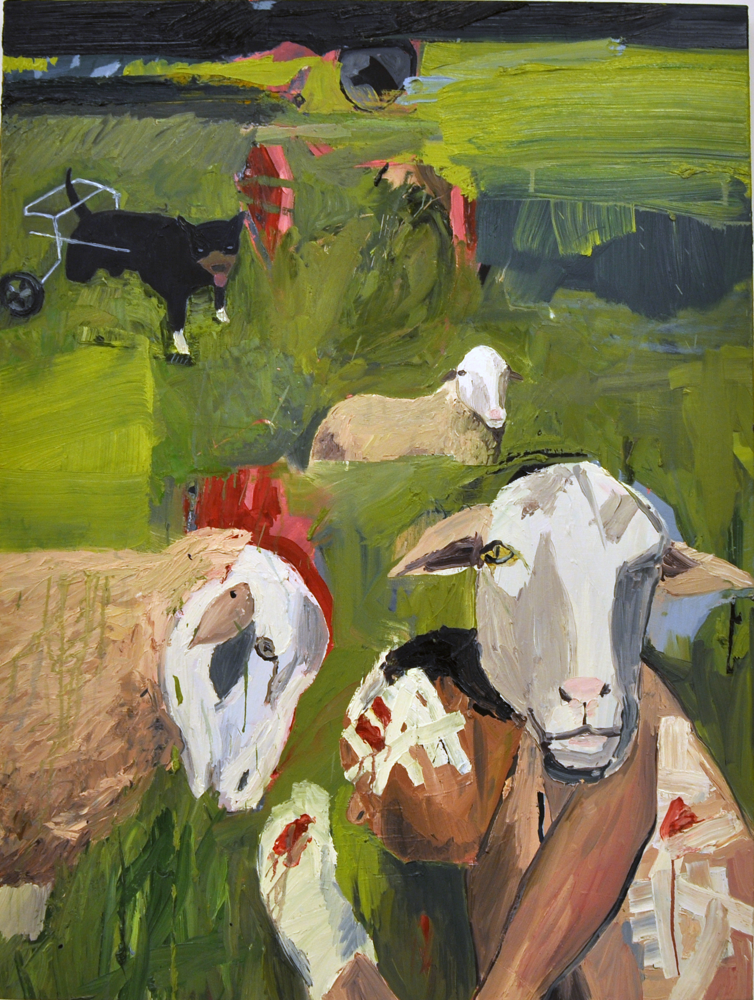 

## Proposition
En passant par le collage pour créer un premier modèle, utilisez la technique que vous voulez pour créer un travail autour du thème du "corps fragmenté".